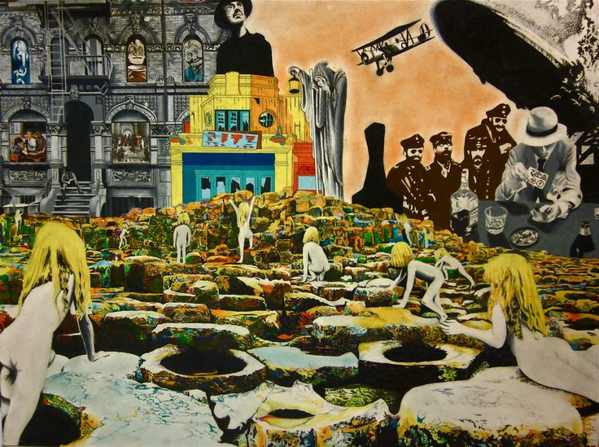

# {{ page.title }}

You have failed as citizens of your castes in the Hegemony's capital.
Since then, you have accumulated enormous debts with one of the capital's factions.

But your debts were collected by a Financier from the North.
This pioneer issued a permit to export you to the Violet City in the northern steppes.
Upon arriving in the Violet City, you can still acquire an import permit to return to the Hegemony.
But this will cost £3,500.




# System

***Failed Exports*** is a **Cairn 2e** campaign, using alternative backgrounds.  
**Cairn 2e**'s <a href="https://cairnrpg.com/second-edition/" target="_blank">website version</a> and <a href="https://drive.google.com/file/d/1b8mFMxYSdlwrsfwhT0CNalPoW9gdl5uE/view?usp=drivesdk" target="_blank">PDF version</a> are available for free.  
**UVG**'s <a href="https://wizardthieffighter.itch.io/uvg-free-player-guide" target="_blank">Player Guide</a> is also available for free.  

  

    <b>EXPAND TO CREATE A CHARACTER</b>  
  

---

  <iframe
    src="https://null.perchance.org/chargedrpg"
    style="border:none; width:90%; height:100%;"
    allowfullscreen
  ></iframe>

## Travel procedures

Cairn travel procedures are replaced with UVG's.  
For tables that go to 20+, PCs may roll an additional d6 if they have a relevant background.

