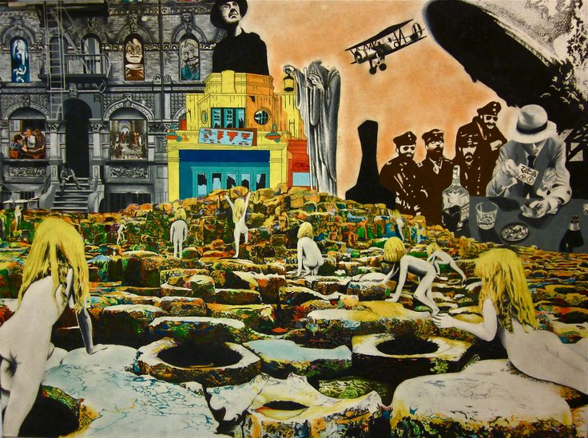

**charged**
{: .text-alpha }

...

---
## Appendix N

### art board

<iframe style="border-radius:12px" src="https://petracoding.github.io/pinterest/board.html?link=estevaoseco/charged/&hideHeader=1&hideFooter=1&transparent=1" width="100%" height="652" frameBorder="0" style="color-scheme: site" allowfullscreen=""></iframe>

### playlist

<iframe style="border-radius:12px" src="https://open.spotify.com/embed/playlist/3sTCMlmuKBhgN1OSUWzxGd?utm_source=generator" width="100%" height="352" frameBorder="0" allowfullscreen="" allow="autoplay; clipboard-write; encrypted-media; fullscreen; picture-in-picture" loading="lazy"></iframe>

### novels & films

---
## Open Table

**GM:** efsa (Estêvão)  
**Format**: [Open Table](https://www.thearcanelibrary.com/blogs/shadowdark-blog/open-table-how-the-creators-of-d-d-ran-their-games?srsltid=AfmBOoqNYWIzVWFjQKEoyumD4NTcFvhdkiVGQgaluf5LKmkS3-ORyFI7), sandbox & episodic  
**Frequency**: Every 6~8 days  
**Time & Duration**: 1945 UTC for 2~3h  
**Sign-up**: First come first served, 2 to 5 players  
**TTRPG system**: [Cairn 2e](https://cairnrpg.com/second-edition/)  
**Genre**: Surreal Science Fantasy  
**VTT**: Theatre of the mind + Owlbear Rodeo  
**Language**: English  
**Communication**: Discord voice (video is optional)  
**Content warnings**: Violence, body horror, corruption, assimilation, psychological distress, sexual content (veiled), oppression  
**Notes**:  
Downtime and some light conversations with characters may be done through PbP.

 Session text

**unsettled** | Cairn 2e [Open Table]

[Campaign website](https://terra-campaigns.github.io/unsettled/)  
[Latest events](https://terra-campaigns.github.io/unsettled/#timeline-of-events)  
[Create a character](https://terra-campaigns.github.io/unsettled/systems/#character-generation)  
[Campaign hexmap](https://www.owlbear.rodeo/room/yxcSrOn0eZ_r/Unsettled)  
[Kettlewright](https://kettlewright.com/) party code: 3dfe1c7a085bbf35

2 hours and 45 minutes




